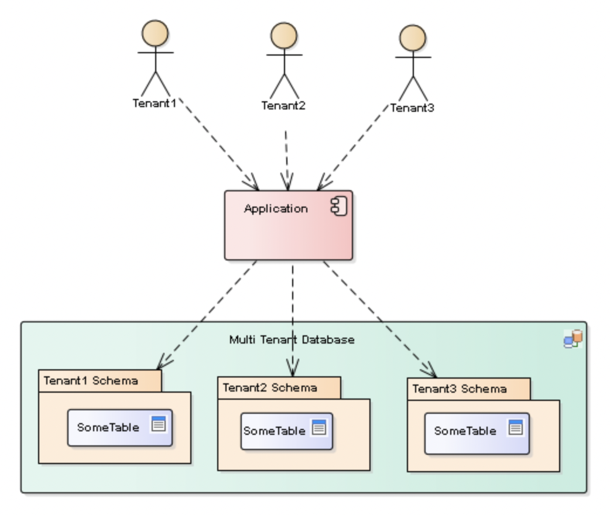

# Multi-tenancy

## Implement the Schema-per-tenant pattern using Hibernate

The Schema Strategy employs a single database server like the DISCRIMINATOR strategy but specifies a schema instance per
tenant meaning that each tenant has complete isolation at the data layer from other tenants.

### Pros

1. Tenant data is robustly isolated from other tenant data:
    1. This in turn means for simpler more robust application development. However the application must be tenant aware
       and capable of switching tenants reliably.
    2. Schema & table corruption affects only a single tenant
    3. Ad-hoc queries are automatically scoped to a single tenant.
2. Granular backups can be taken and restored with ease & in parallel.
3. Tenants can be migrated to and from different environments easily.
4. Instrumentation is available on a per schema basis allowing the attribution of load and bottlenecks to specific
   tenant generated load.
5. Single database service account to manage per application.
6. Single database instance to tune and maintain.

### Cons

1. As a single database service is serving all tenants, performance is subject to noisy neighbors similar to the
   DISCRIMINATOR strategy. However it is trivial to move problem customers onto dedicated databases should the need
   arise.

2. If your database goes down, all your customers go down, again necessitating a good failover strategy.
3. Tooling needs to be built to handle schema updates, backups and restores of the tenant schemas with an environment.
4. Reporting across tenants requires additional tooling.
5. De-normalization of common reference tables may be necessary or a '
   common/admin' schema employed and shared by all tenants. This in itself can assist in some of the maintenance tooling
   mentioned.

We will now only need a single `dataSource`, we no longer have to override the Spring Boot default DataSource. We will
use a `master` schema for the master repository with information about each tenant and its corresponding schema.